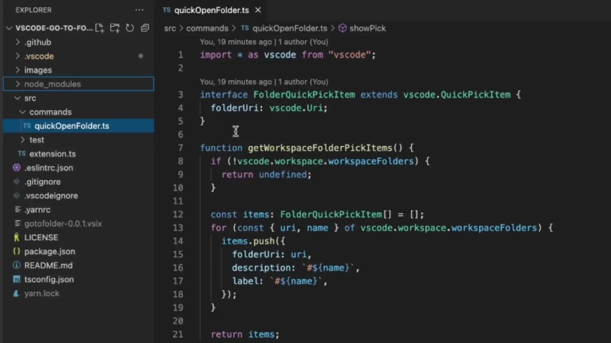
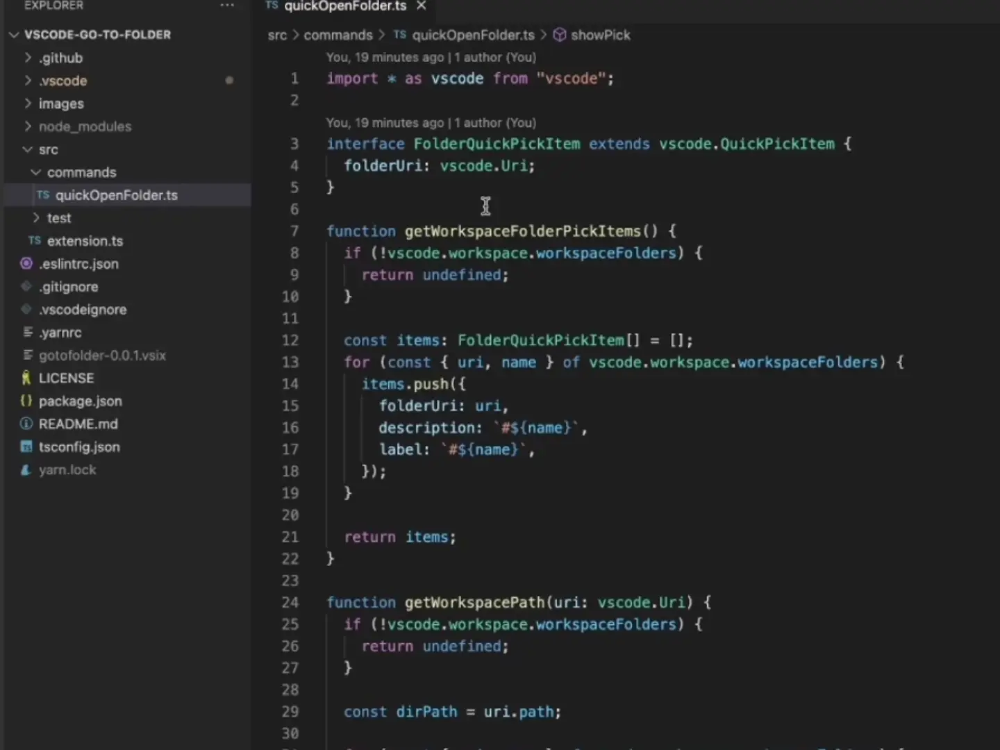

# Go to Folder

Quick go to folder.

## Features

### Start go to folder by menu



### Start go to folder by command palette



## Install via CLI

```bash
code --install-extension zjffun.gotofolder
```

## Release Notes

### [TODO]

### [Unreleased]

## v0.1.0

Handle error.

## v0.0.8

Prefers to run as a workspace extension.

## v0.0.7

Prefers to run as a UI extension.

## v0.0.6

- Added features pick root dir.
- Fix pick symbolic link dir wrong.
- Fix direct pick file doesn't take effect.

### v0.0.5

- Fix title of QuickPick.

### v0.0.4

- Added features go to file.

### v0.0.3

- Added features support using in browser editor.

### v0.0.2

- Update info.

### v0.0.1

- Added features go to folder.
