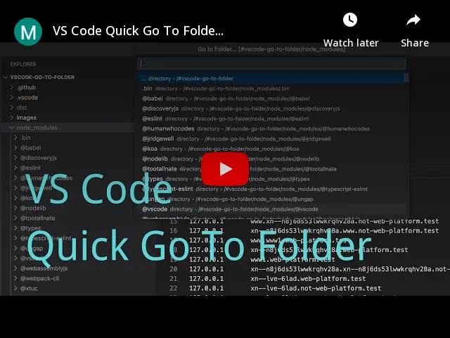

# Go to Folder

English | [简体中文](./README.zh-CN.md)

[](https://marketplace.visualstudio.com/items?itemName=zjffun.gotofolder)
[](https://marketplace.visualstudio.com/items?itemName=zjffun.gotofolder)
[](https://marketplace.visualstudio.com/items?itemName=zjffun.gotofolder)
[](https://marketplace.visualstudio.com/items?itemName=zjffun.gotofolder&ssr=false#review-details)
[](https://open-vsx.org/extension/zjffun/gotofolder)
[](./LICENSE)

Quick go to folder.

[](https://www.youtube.com/watch?v=ORRnb8-WRrc)

## Features

### Start go to folder by menu


### Start go to folder by command palette


### Open folder in new window


## Install via CLI

```bash
code --install-extension zjffun.gotofolder
```

## [Release Notes](./CHANGELOG.md)
