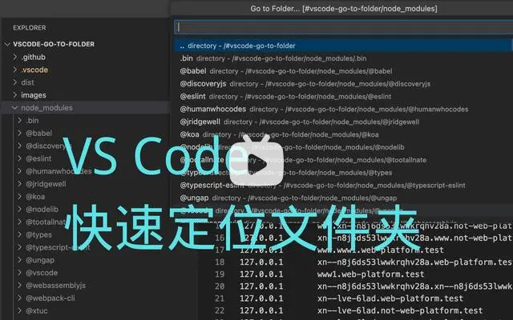
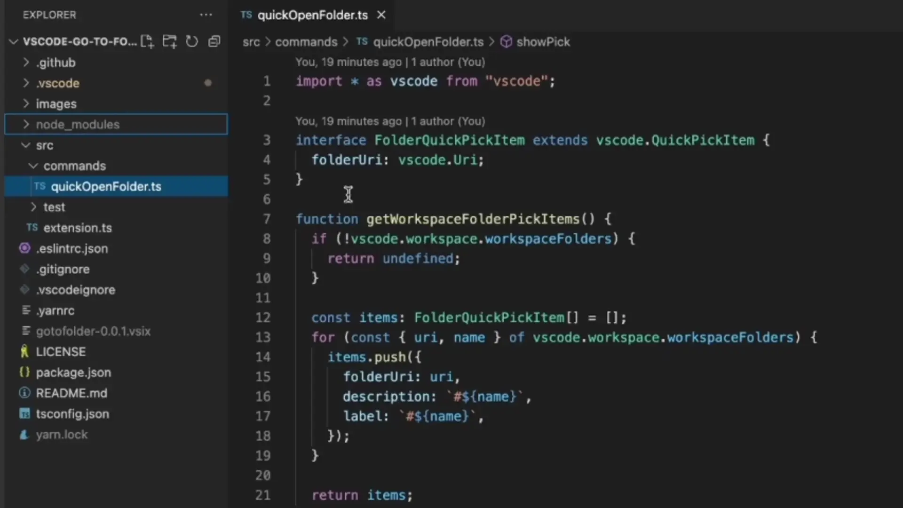
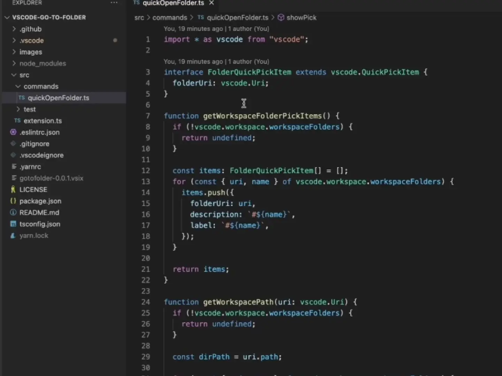
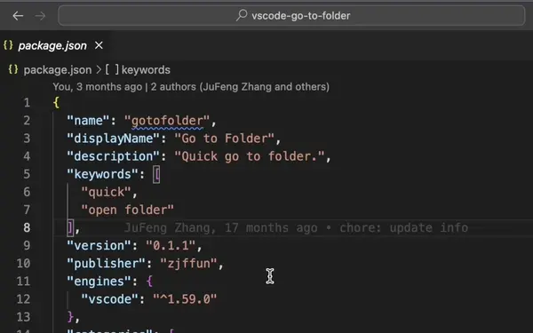

# Go to Folder

[English](./README.md) | 简体中文

[](https://marketplace.visualstudio.com/items?itemName=zjffun.gotofolder)
[](https://marketplace.visualstudio.com/items?itemName=zjffun.gotofolder)
[](https://marketplace.visualstudio.com/items?itemName=zjffun.gotofolder)
[](https://marketplace.visualstudio.com/items?itemName=zjffun.gotofolder&ssr=false#review-details)
[](https://open-vsx.org/extension/zjffun/gotofolder)
[](./LICENSE)

快速定位到文件夹。

[](https://www.bilibili.com/video/BV1Kg4y1N7JV)

## 功能

### 通过右键菜单打开



### 通过命令面板打开



### 在新窗口中打开文件夹



## 通过命令行安装

```bash
code --install-extension zjffun.gotofolder
```

## [更新日志](./CHANGELOG.md)
