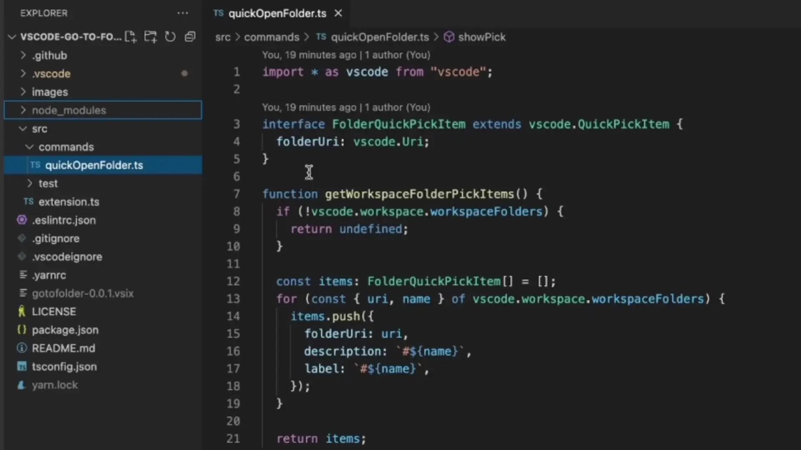

# Go to Folder

[English](./README.md) | 简体中文

快速定位到文件夹。

[](https://www.youtube.com/watch?v=ORRnb8-WRrc)

## 功能

### 通过右键菜单打开



### 通过命令面板打开


### 在新窗口中打开文件夹


## 通过命令行安装

```bash
code --install-extension zjffun.gotofolder
```
